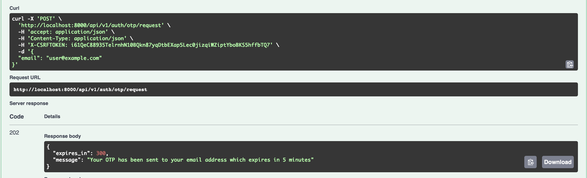
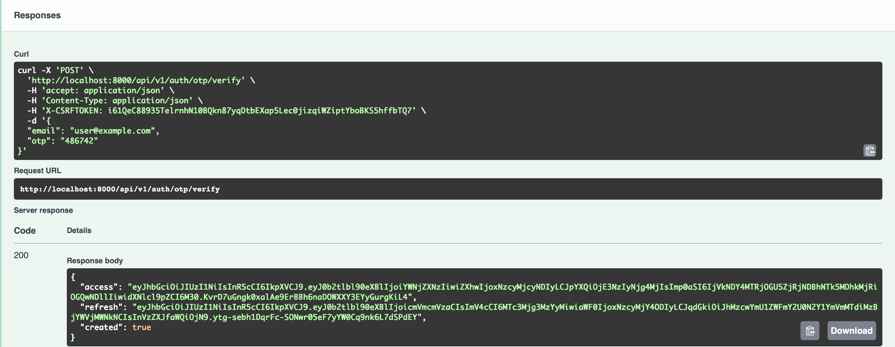
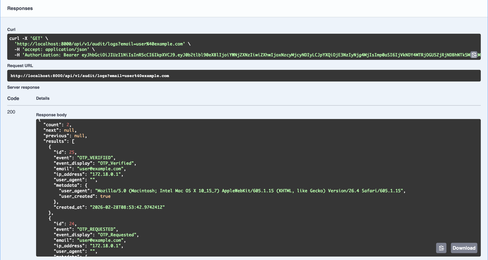
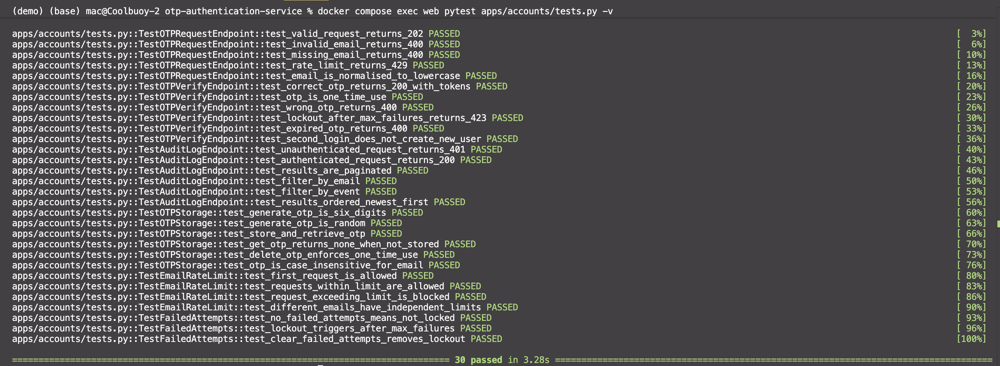

# OTP Authentication Service

A focused Django REST API that implements email-based one-time passcode sign-in. Users request a short-lived numeric code, then exchange it for a JWT token pair. The service enforces per-email and per-IP rate limits, locks accounts after repeated failures, and records every event to a queryable audit log.

---

## Table of Contents

- [Architecture](#architecture)
- [Project Structure](#project-structure)
- [Quick Start](#quick-start)
- [Environment Variables](#environment-variables)
- [API Reference](#api-reference)
- [Implementation Details](#implementation-details)
- [Test Suite](#test-suite)
- [Assessment Checklist](#assessment-checklist)

---

## Architecture

```
HTTP Request
    │
    ▼
┌─────────────────────────────────────────┐
│           Django REST Framework          │
│   OTPRequestView │ OTPVerifyView        │
└────────────┬────────────────────────────┘
             │
    ┌────────▼────────┐
    │   otp_service   │  ← business logic, custom exceptions
    └────────┬────────┘
             │
    ┌────────▼────────┐      ┌──────────────────┐
    │  redis_service  │─────▶│  Redis (db=0)    │
    └─────────────────┘      │  OTPs, counters  │
                             └──────────────────┘
             │
    ┌────────▼────────┐      ┌──────────────────┐
    │  Celery tasks   │─────▶│  Redis (db=1/2)  │
    │  (async)        │      │  Broker/Results  │
    └────────┬────────┘      └──────────────────┘
             │
    ┌────────▼────────┐      ┌──────────────────┐
    │  AuditLog model │─────▶│  PostgreSQL      │
    └─────────────────┘      │  Persistent logs │
                             └──────────────────┘
```

**Key design decision — three Redis databases:** OTP/counter state lives in `db=0` (via `django-redis`), Celery broker in `db=1`, and Celery results in `db=2`. This prevents key collisions and makes it easy to flush each namespace independently.

---

## Project Structure

```
otp-authentication-service/
├── apps/
│   ├── accounts/
│   │   ├── services/
│   │   │   ├── otp_service.py      # request_otp(), verify_otp(), custom exceptions
│   │   │   └── redis_service.py    # OTP storage, Lua atomic counter, rate limits
│   │   ├── serializers.py          # Input validation and response shapes
│   │   ├── tasks.py                # Celery: send_otp_email, write_audit_log
│   │   ├── views.py                # OTPRequestView, OTPVerifyView
│   │   └── tests.py                # 30 unit + integration tests
│   └── audit/
│       ├── models.py               # AuditLog model with TextChoices
│       ├── filters.py              # django-filter: email, event, date range
│       ├── serializers.py
│       └── views.py                # AuditLogListView (JWT-protected)
├── config/
│   ├── settings.py                 # All config via environment variables
│   ├── celery.py                   # Celery app, autodiscovery
│   └── urls.py                     # Routes + Swagger
├── conftest.py                     # pytest fixtures and Redis mock strategy
├── pytest.ini
├── Dockerfile
├── docker-compose.yml
└── requirements.txt
```

---

## Quick Start

**Prerequisites:** Docker Desktop with the Compose plugin.

```bash
# 1. Copy and configure environment
cp .env.example .env

# 2. Start all services (web, celery_worker, postgres, redis)
docker compose up --build

# 3. API is live at http://localhost:8000
# 4. Swagger UI: http://localhost:8000/api/schema/swagger/
# 5. Performance profiling: http://localhost:8000/silk/
```

**Run the test suite:**

```bash
docker compose exec web pytest apps/accounts/tests.py -v
```

**Useful commands:**

```bash
# Tail logs for a service
docker compose logs -f celery_worker

# Open a Django shell
docker compose exec web python manage.py shell

# Run a targeted test class
docker compose exec web pytest apps/accounts/tests.py::TestEmailRateLimit -v
```

---

## Environment Variables

All configuration is read from `.env` via `python-decouple`. No defaults are assumed for secrets.

| Variable                        | Required | Default                | Description                           |
| ------------------------------- | -------- | ---------------------- | ------------------------------------- |
| `SECRET_KEY`                    | ✅       | —                      | Django secret key                     |
| `DEBUG`                         |          | `False`                | Enable debug mode                     |
| `ALLOWED_HOSTS`                 |          | `localhost`            | Comma-separated hostnames             |
| `POSTGRES_DB`                   | ✅       | —                      | Database name                         |
| `POSTGRES_USER`                 | ✅       | —                      | Database user                         |
| `POSTGRES_PASSWORD`             | ✅       | —                      | Database password                     |
| `REDIS_URL`                     |          | `redis://redis:6379/0` | Redis connection for OTP/counters     |
| `CELERY_BROKER_URL`             |          | `redis://redis:6379/1` | Celery task broker                    |
| `CELERY_RESULT_BACKEND`         |          | `redis://redis:6379/2` | Celery result store                   |
| `OTP_TTL_SECONDS`               |          | `300`                  | OTP expiry (5 minutes)                |
| `OTP_REQUEST_RATE_EMAIL_MAX`    |          | `3`                    | Max OTP requests per email per window |
| `OTP_REQUEST_RATE_EMAIL_WINDOW` |          | `600`                  | Email rate window in seconds (10 min) |
| `OTP_REQUEST_RATE_IP_MAX`       |          | `10`                   | Max OTP requests per IP per window    |
| `OTP_REQUEST_RATE_IP_WINDOW`    |          | `3600`                 | IP rate window in seconds (1 hour)    |
| `OTP_REQUEST_RATE_FAILED_MAX`   |          | `5`                    | Failed verify attempts before lockout |
| `OTP_REQUEST_RATE_EMAIL_WINDOW` |          | `900`                  | Lockout window in seconds (15 min)    |

---

## API Reference

### `POST /api/v1/auth/otp/request`

Generates a 6-digit OTP and dispatches it via email (logged to Celery worker output in development). Enforces per-email and per-IP rate limits before proceeding.

**Request:**

```json
{ "email": "alice@example.com" }
```

**Responses:**

| Status | Condition                | Body                                                           |
| ------ | ------------------------ | -------------------------------------------------------------- |
| `202`  | OTP sent                 | `{ "message": "...", "expires_in": 300 }`                      |
| `400`  | Invalid or missing email | DRF validation errors                                          |
| `429`  | Rate limit exceeded      | `{ "error": "...", "retry_after": 42 }` + `Retry-After` header |

**Sample Image**


---

### `POST /api/v1/auth/otp/verify`

Validates the submitted OTP, issues JWT tokens on success, and deletes the OTP to enforce single-use semantics.

**Request:**

```json
{ "email": "alice@example.com", "otp": "482910" }
```

**Responses:**

| Status | Condition                         | Body                                                     |
| ------ | --------------------------------- | -------------------------------------------------------- |
| `200`  | OTP correct                       | `{ "access": "...", "refresh": "...", "created": true }` |
| `400`  | OTP wrong or expired              | `{ "error": "...", N attempts remaining }`               |
| `423`  | Account locked after max failures | `{ "error": "...", "unlock_eta": 847 }`                  |

**Sample Image**


---

### `GET /api/v1/audit/logs`

Paginated list of all audit events. Requires a valid JWT `Bearer` token.

**Query parameters:** `email`, `event` (`OTP_REQUESTED` \| `OTP_VERIFIED` \| `OTP_FAILED` \| `OTP_LOCKED`), `from_date`, `to_date` (ISO 8601).

**Response:** Standard DRF pagination envelope — `count`, `next`, `previous`, `results`.

**Example with token:**

```bash
curl http://localhost:8000/api/v1/audit/logs \
  -H "Authorization: Bearer <access_token>" \
  -G --data-urlencode "event=OTP_FAILED"
```

**Sample Image**


---

## Implementation Details

### Atomic Rate Limiting (Lua Script)

Incrementing a counter and setting its TTL are two separate Redis commands. Between them, a server crash or a concurrent request could leave the key without a TTL — permanently blocking the user. To prevent this, a Lua script runs both operations atomically on the Redis server:

```lua
local count = redis.call('INCR', KEYS[1])
if count == 1 then
    redis.call('EXPIRE', KEYS[1], ARGV[1])
end
return count
```

Redis is single-threaded: while this script executes, nothing else runs. The TTL is set only on the first increment — subsequent calls within the window leave the expiry unchanged, preserving the sliding window. This is used for all three counter types: per-email request rate, per-IP request rate, and per-email failed attempts.

### OTP Storage

OTPs are stored using `SETEX` — a single atomic command that sets the value and TTL together, avoiding the same race condition as above. The key scheme uses `:` as a namespace separator:

```
otp:value:{email}           → the OTP code
rate:otp_req:email:{email}  → email request counter
rate:otp_req:ip:{ip}        → IP request counter
rate:otp_fail:{email}       → failed attempt counter
```

All email keys are normalised to lowercase in the key builder, not just in serializer validation — so the Redis layer is case-insensitive by design regardless of how a value enters the system.

### Verify Flow

`verify_otp()` in `otp_service.py` follows a strict sequence:

1. **Check lockout first** — if the failed-attempt counter has hit `FAILED_MAX`, raise `OTPLocked` immediately without touching the OTP or incrementing any counter.
2. **Validate the OTP** — retrieve from Redis and compare. On mismatch, increment the failure counter atomically. If this increment hits `FAILED_MAX`, raise `OTPLocked`; otherwise raise `OTPInvalid` with the remaining attempt count.
3. **On success** — delete the OTP (single-use), clear the failure counter, call `User.objects.get_or_create(email=...)` (the `created` flag in the response tells the caller whether this is a new account), and issue a JWT token pair.

All audit events (`OTP_REQUESTED`, `OTP_VERIFIED`, `OTP_FAILED`, `OTP_LOCKED`) are written asynchronously via Celery to keep the request path fast.

### Custom Exceptions

`otp_service.py` uses typed exceptions that carry structured data for the view to use directly:

```python
class RateLimitExceeded(Exception):
    def __init__(self, message, retry_after=0): ...

class OTPLocked(Exception):
    def __init__(self, unlock_eta=0): ...

class OTPInvalid(Exception): ...
```

The views catch each type separately and map them to the appropriate HTTP status and response body. This keeps exception handling out of the service layer and makes the view code straightforward.

### IP Detection

```python
def get_client_ip(request):
    forwarded_for = request.META.get("HTTP_X_FORWARDED_FOR")
    if forwarded_for:
        return forwarded_for.split(",")[0].strip()
    return request.META.get("REMOTE_ADDR", "unknown")
```

`X-Forwarded-For` is a comma-separated list of IPs in the format `client, proxy1, proxy2`. The leftmost value is the originating client IP. `REMOTE_ADDR` is the fallback when not behind a proxy.

### Celery Tasks

Both tasks are bound (`bind=True`) to access `self.retry()`:

- `send_otp_email` — logs the OTP code to the Celery worker output. In production, replace the log statement with your email provider call. Retries up to 3 times with a 60-second delay.
- `write_audit_log` — creates an `AuditLog` record. The import of `AuditLog` is deferred inside the task body to avoid circular imports during Django initialisation. Retries up to 5 times with a 30-second delay.

### JWT Configuration

```python
SIMPLE_JWT = {
    "ACCESS_TOKEN_LIFETIME": timedelta(minutes=60),
    "REFRESH_TOKEN_LIFETIME": timedelta(days=7),
    "ROTATE_REFRESH_TOKENS": True,
    "ALGORITHM": "HS256",
    "AUTH_HEADER_TYPES": ("Bearer",),
}
```

`ROTATE_REFRESH_TOKENS = True` issues a new refresh token on every use, which limits the exposure window if a refresh token is leaked.

---

## Test Suite

All 30 tests pass.


Run them with:

```bash
docker compose exec web pytest apps/accounts/tests.py -v
```

### Test Infrastructure (`conftest.py`)

**The EVALSHA problem:** `redis-py`'s `register_script()` pre-loads the Lua script via `SCRIPT LOAD` and executes it with `EVALSHA`. `fakeredis` does not implement `EVALSHA`, causing every rate-limit test to fail with `ResponseError: unknown command evalsha`.

**The fix:** Rather than modifying production code, `conftest.py` patches `_atomic_increment` — the private function that wraps the Lua call — with an in-memory counter. This completely bypasses the Lua/EVALSHA path while still exercising all the logic that depends on it.

The `_InMemoryCounter` class replicates the exact contract of the Lua script:

- Increments a per-key counter on each call
- Sets the TTL window only on the first call for each key (matching the Lua `if count == 1` guard)
- **Mirrors the count back into the shared `fakeredis` instance** via `setex` — necessary because `check_failed_attempts()` reads the counter directly with `client.get()` rather than through `_atomic_increment`. Without this mirror step, the two code paths would see different data stores.

The `fake_redis` fixture is `autouse=True`, so it applies to every test. The counter is reset and a fresh `FakeRedis` instance is created before each test, giving full isolation.

### Test Groups

**`TestOTPStorage`** (6 tests) — unit tests for OTP generation and Redis operations. Covers: 6-digit numeric format, randomness (10 samples must include more than 1 distinct value), store/retrieve round-trip, `None` for unknown keys, deletion enforcing single-use, and case-insensitive email key normalisation.

**`TestEmailRateLimit`** (4 tests) — unit tests for `check_email_rate_limit()`. Covers: first request is allowed, all requests up to `EMAIL_MAX` are allowed, the request immediately after exhausting the limit is blocked with a positive `retry_after`, and counters are scoped per-email (exhausting one does not affect another).

**`TestFailedAttempts`** (3 tests) — unit tests for the lockout counter. Covers: no failures means not locked, exactly `FAILED_MAX` failures triggers a lock with positive ETA, and `clear_failed_attempts()` resets the lock. The lockout test was the one that exposed the split-brain issue in the mock and required the `setex` mirror fix.

**`TestOTPRequestEndpoint`** (5 tests) — HTTP integration tests for `POST /api/v1/auth/otp/request`. Covers: valid request returns 202 with `expires_in`, invalid email returns 400, missing email returns 400, rate limit returns 429, and email is normalised to lowercase before storage (a security-relevant invariant: mixed-case cannot be used to bypass rate limits).

**`TestOTPVerifyEndpoint`** (6 tests) — HTTP integration tests for `POST /api/v1/auth/otp/verify`. The `_request_otp()` helper writes OTPs directly into `fakeredis` via `store_otp()`, bypassing the request endpoint for precise setup. Covers: correct OTP returns 200 with tokens, OTP is single-use (second attempt returns 400), wrong OTP returns 400, lockout after `FAILED_MAX` failures returns 423 with `unlock_eta`, expired/absent OTP returns 400, and re-verifying with the same email returns `created: false`.

**`TestAuditLogEndpoint`** (6 tests) — HTTP integration tests for `GET /api/v1/audit/logs`. The `authenticated_client` fixture creates a real user and issues a genuine JWT via `RefreshToken.for_user()`. Covers: unauthenticated request returns 401, authenticated request returns 200 with pagination envelope, 25 records returns page of 20 with `next` populated, `?email=` filter, `?event=` filter, and results ordered newest-first.

---

## Assessment Checklist

| Requirement                      | Implementation                                                 | Where to look                                      |
| -------------------------------- | -------------------------------------------------------------- | -------------------------------------------------- |
| 6-digit OTP via `secrets` module | `generate_otp()` uses `secrets.choice(string.digits)`          | `redis_service.py`                                 |
| OTP stored with atomic TTL       | `store_otp()` uses `SETEX` (single command)                    | `redis_service.py`                                 |
| Atomic INCR + EXPIRE             | Lua script via `register_script()`                             | `redis_service.py` → `_INCR_WITH_TTL_SCRIPT`       |
| Per-email rate limiting          | `check_email_rate_limit()` → `_atomic_increment()`             | `redis_service.py`, `otp_service.py`               |
| Per-IP rate limiting             | `check_ip_rate_limit()` → `_atomic_increment()`                | `redis_service.py`, `views.py` → `get_client_ip()` |
| Failed-attempt lockout           | `record_failed_attempt()`, `check_failed_attempts()`           | `redis_service.py`, `otp_service.py`               |
| OTP single-use enforcement       | `delete_otp()` called on successful verify                     | `otp_service.py` → `verify_otp()`                  |
| JWT token issuance               | `RefreshToken.for_user(user)` on success                       | `otp_service.py` → `verify_otp()`                  |
| User get-or-create               | `User.objects.get_or_create(email=email)`                      | `otp_service.py` → `verify_otp()`                  |
| Async email dispatch             | `send_otp_email.delay(email, otp)`                             | `tasks.py`                                         |
| Async audit logging              | `write_audit_log.delay(event, email, ip, meta)`                | `tasks.py`                                         |
| Celery task retries              | `bind=True`, `max_retries`, `default_retry_delay`              | `tasks.py`                                         |
| AuditLog model                   | `event`, `email`, `ip_address`, `metadata`, `created_at`       | `audit/models.py`                                  |
| Audit API with JWT auth          | `IsAuthenticated` on `AuditLogListView`                        | `audit/views.py`                                   |
| Filtering and pagination         | `AuditLogFilter`, `PAGE_SIZE = 20`                             | `audit/filters.py`, `settings.py`                  |
| Swagger documentation            | `extend_schema` on all views, `drf-spectacular`                | `views.py`, `audit/views.py`                       |
| Dockerized stack                 | `web`, `celery_worker`, `postgres`, `redis` with health checks | `docker-compose.yml`                               |
| Config via environment           | `python-decouple` throughout `settings.py`                     | `settings.py`                                      |
| 30 passing tests                 | pytest with fakeredis, `_atomic_increment` patched             | `tests.py`, `conftest.py`                          |

# tses-otp-assessment
